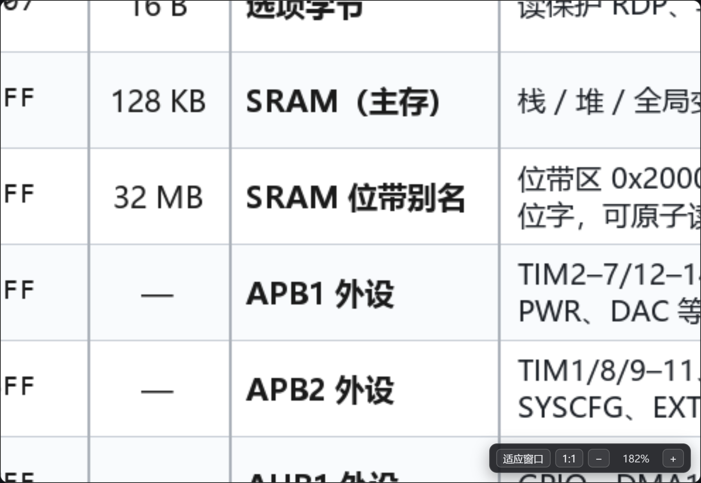
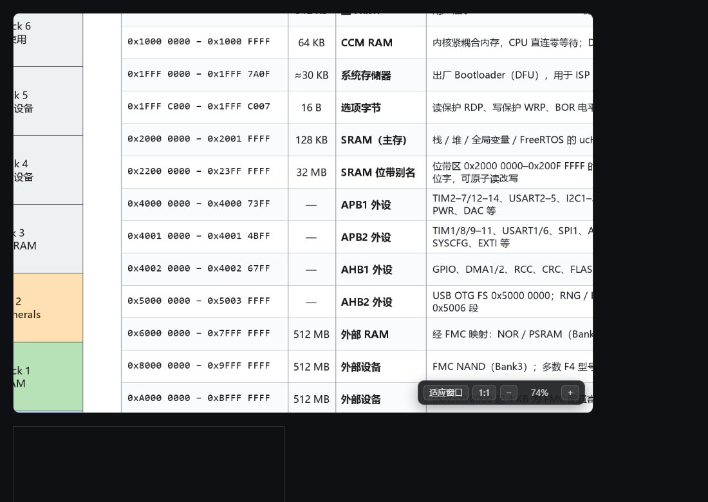

**English** · [简体中文](README.md)

# dsh-sidebar-image-zoom

Pointer-anchored wheel zoom and drag-to-pan for images opened in the DeepSeek
Harness right sidebar.

DSH's built-in image pane fits a bitmap to the pane and stops there. The only
controls are a `+` / `−` / `适应窗口` strip that stays hidden until the pointer
reaches the bottom edge, and even then the zoom is centred on the pane, not on
what you are looking at. There is no way to pan at all. This plugin replaces
that renderer outright.



## Gestures

| Gesture | Result |
| --- | --- |
| Wheel | Zoom, anchored on the pixel under the cursor |
| Drag | Pan — pointer capture, so the cursor may leave the pane mid-drag |
| Double-click | Toggle fit ⇄ 1:1 |
| `F` / `Esc` | Fit to the pane |
| `1` | 100% |
| `+` `-` `=` `_` | Step the zoom about the centre |
| Control strip | Always visible: `适应窗口` · `1:1` · `−` · readout · `+` |

The readout tracks the live scale. A manual zoom belongs to you: it survives
pane resizes, and only `适应窗口` or opening a different image returns to fit.



## Install

The plugin is not published to npm, so DSH's *Plugins → Add plugin* flow
(which resolves a registry spec) will not find it. Clone it next to your
profile and stage it by hand — or on Windows use the bundled script.

```bash
git clone https://github.com/MYX-0211/dsh-sidebar-image-zoom.git
```

Then place the package where your profile can resolve it (typically
`<profile>/node_modules/dsh-sidebar-image-zoom/`), add it to the profile's
`dependencies` and to `dsh.profile.bundles` in the profile `package.json`, and
restart DSH.

`install.ps1` / `uninstall.ps1` do exactly that for the standard profile
location, through `tools/manifest_edit.py`. That script edits the manifest
line by line instead of doing a JSON round-trip, so untouched formatting is
preserved, and it writes a timestamped `package.json.bak-*` before each write.

```powershell
# Windows, if the execution policy blocks .ps1 files, read the script inline
Invoke-Expression ([IO.File]::ReadAllText(".\install.ps1", [Text.Encoding]::UTF8))
Invoke-Expression ([IO.File]::ReadAllText(".\uninstall.ps1", [Text.Encoding]::UTF8))
```

Both directions are idempotent, and an uninstall → install round trip was
verified byte-identical to the original manifest.

**DSH loads plugins at boot, so restart it once after installing.**

## How it hooks in

DSH lets a plugin own a document renderer through `ctx.documentPreviews`. The
match order is

```js
right.rank - left.rank || right.length - left.length || left.order - right.order
```

where `rank` is `priority === "builtin" ? 0 : 1`. The built-in bitmap viewer
registers itself with `priority: "builtin"`, so **any other priority value
outranks it**. This plugin registers `priority: "extension"` over the same
suffix list and therefore takes over the image pane outright — no configuration,
no user-facing switch.

The body itself has to be registered in the keyed child slot
`sidebar.right.tab.document` under exactly the same key as the registry id,
because the host resolves it with `entryKey: selected.id`:

```js
ctx.documentPreviews.register({ id: BODY_ID, extensions, binaryExtensions,
                                priority: "extension", loading: "bytes-complete" })
ctx.slots.inject("sidebar.right.tab.document", () =>
  ctx.slots.register({ name: "sidebar.right.tab.document", key: BODY_ID }, Body))
```

Two details that are easy to get wrong:

- `binaryExtensions` must be a subset of `extensions`, and SVG is deliberately
  left out of it so that the plain-text renderer stays available for reading
  vector source.
- Both registrations are owned by `ctx.effect`, and the body is wrapped in an
  error boundary. A throw from a renderer blanks the entire sidebar panel, not
  just the tab — the boundary turns that into a message and leaves the tab's
  renderer dropdown as the way out.

There is no build step. `lib/client.js` is hand-written and self-registers via
`window.__ModuleLoader__.load`; only `react` is required, and it comes from the
host.

Failures degrade to a message rather than an empty pane: bytes that match no
known signature, bytes whose suffix promises a format they are not, and a tab
that has not received its content yet each get their own short note.

## Files

| Path | Role |
| --- | --- |
| `lib/client.js` | The whole plugin (browser half) |
| `lib/index.js` | Empty host half — satisfies the bundle contract |
| `cordis.patch.yml` | Mounts the package. The `id` must stay `sidebar-image-zoom` — mounting the same package twice under one tree fails the boot |
| `tools/manifest_edit.py` | Line-based profile manifest editor |
| `install.ps1`, `uninstall.ps1` | Stage the package and edit the manifest |
| `test/build-harness.mjs` | Builds a self-contained harness page |
| `test/verify.mjs` | Drives that page with a real browser |

## Testing

The suite loads `lib/client.js` **verbatim** into a page that fakes only what
DSH itself provides — `window.__ModuleLoader__`, `require`, and a recording
cordis context — then mounts the registered body and drives it with real
mouse and wheel events through Edge or Chrome. The test image is drawn at run
time with canvas, so no binary fixtures are committed.

```bash
npm install
npm test
```

`puppeteer-core` is used rather than `puppeteer` so that installing the dev
dependency does not pull down a second Chromium. The runner finds a browser at
`PUPPETEER_EXECUTABLE_PATH`, then the usual Edge and Chrome locations, then the
usual Linux and macOS paths. Point it somewhere explicitly if yours lives
elsewhere:

```bash
PUPPETEER_EXECUTABLE_PATH=/usr/bin/chromium npm test
```

A full run is 30 assertions. The two that carry the point of the plugin:

```
PASS  zoom is anchored at the cursor            — image point under cursor moved 0.00px
PASS  drag pans by the pointer delta            — moved (-140.0, -90.0), expected (-140, -90)
```

It also asserts the registration contract (claimed suffixes, `binaryExtensions`
⊆ `extensions`, `priority !== "builtin"`, `loading: "bytes-complete"`, slot key
=== registry id, both registrations owned by effects), the control strip, the
double-click toggle from a pinned precondition, that a corrupt file reports a
decode failure instead of blanking, that fallback messages stay inside their
pane, and that nothing reaches the console.

## Compatibility

Built and tested against DSH `0.2.0-rc.2` on the `desktop` profile. It reaches
into DSH internals — the slot name, the registry shape, and the `builtin`
rank — so a release that changes any of those can break it. When that happens
the symptom is a blank sidebar panel, and the fix is to disable the bundle and
reload; the fault will not take the rest of the UI with it.

## License

MIT — see [LICENSE](LICENSE).
